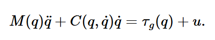
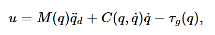
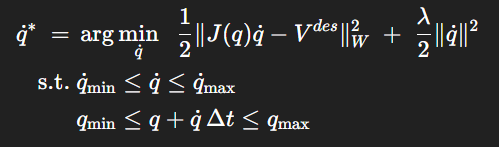

## Inverse Dynamics Control
(aka "Computed-torque Control")
- Dynamics of a fully-actuated manipulator:
	<center></center>
	- $u$ are joint torques (aka "generalized forces")
- Inverse dynamics control sets:
	- 	<center></center>
	- Plugging this into the manipulator dynamics, we get:
			$$ M(q) \ddot{q} + C(q, \dot{q}) \dot{q} = \tau_g(q) + M(q) \ddot{q}_d + C(q, \dot{q})\dot{q} - \tau_g(q)  \quad \implies \quad M(q) \ddot{q} = M(q)\ddot{q}_d $$
		- Achieving the desired acceleration
- Usually, to follow a trajectory, we don't just differentiate the trajectory $q_0(t)$ twice to get an acceleration trajectory to command to the inverse dynamics controller; we also want some feedback on position/velocity.
	- We therefore choose $\ddot{q}_d$ so the error $(q - q_0)$ between actual robot positions and trajectory planned positions and behaves like a stable 2nd-order system (and therefore converges to 0):
		$$\ddot{q}_0 - \ddot{q}_d + K_p(q - q_0) + K_d(\dot{q} - \dot{q}_0) = 0$$
	- In particular, define $\ddot{q}_d$:
		$$ \ddot{q}_d = \ddot{q}_0 + K_p(q - q_0) + K_d(\dot{q} - \dot{q}_0) = 0 $$
		- Note that as position error and velocity error $(q - q_0)$, $(\dot{q} - \dot{q}_0)$ go to zero, $\ddot{q}_d$ converges to the trajectory's planned acceleration $\ddot{q}_0$
	- We feed our computed $\ddot{q}_d$ to our inverse dynamics control law $u = M(q) \ddot{q}_d + C(q, \dot{q}) \dot{q} - \tau_g (q)$
- Note: even for primitive trajectories (i.e. piece-wise, waypoint trajectories with piecewise zero-order hold velocities)
#### An Aside: Operational Space Control (OSC)
- TODO: REVISIT IN DETAIL
- Basically identical to Inverse Dynamics Control, but you essentially multiply the entire inverse dynamics equation by the task-space Jacobian and use task-space Mass/Coriolis matrices (and you multiply the resulting task-space force by the inverse Jacobian to convert to joint-space torques).
- Goal: track desired task-space accel $\ddot x$
	- First, let's express our manipulator's task-space dynamics in terms of $\ddot{x}$ and task-space inertia matrix $\Lambda(q)$
		- Suppose we have geometric Jacobian: 
				$$ \dot x = J(q) \dot q$$
		- Then:
			$$ \ddot x = J(q) \ddot q + \dot J(q, \dot q) \dot q $$
		- From manipulator dynamics:
				$$ M(q) \ddot q + C(q, \dot q) \dot q = \tau_g(q) + u \quad \implies \quad \ddot q = M^{-1}(\tau_g(q) + u - C(q, \dot q))$$
		- Substituting into the equation for $\ddot x$ to get the manipulator dynamics in terms of $ddot x$:
				$$ \ddot x = J(q)M^{-1}(\tau_g(q) + u - C(q, \dot q)) + \dot J(q, \dot q) \dot q $$
		- Recall the defn. of task-space inertia matrix in terms of joint-space inertia matrix:
				$$ \Lambda(q) := (J M^{-1} J^\top)^{-1} $$
		- We can then rewrite our $\ddot x$ dynamics in terms of $\Lambda(q)$:
			$$ \Lambda(q) \ddot x = \bar J^\top (\tau_g(q) + u - C(q, \dot q) \dot q) + \Lambda(q) \dot J(q, \dot q) \dot q  $$
		- We define task-space force $F := J^{{-1}^\top} u$
				$$ \Lambda \ddot{x} = F \;-\; \Lambda J(q) M^{-1}(q) C(q, \dot q) \dot{q} \;-\; \Lambda J(q) M^{-1}(q) \tau_g \;+\; \Lambda \dot{J}(q, \dot q)\,\dot{q} $$
		- To convert back to motor torques to command the robot, simply apply $u = J^\top F$
- Similar to inverse dynamics control, we define the $\ddot x$ we want to track as a 2nd-order linear system where $\ddot x_{\text{cmd}}$ converges to the planned $\ddot x_0$ when the position and velocity errors are zero as well:
		$$ \ddot{x}_{\mathrm{cmd}} = \ddot{x}_0(t) + K_p\bigl(x_0(t) - x\bigr) + K_d\bigl(\dot{x}_0(t) - \dot{x}\bigr) $$
#### Comparing Inverse Dynamics Control w/ Operational Space Control:
- 


## Differential IK

Broad idea: use Geometric Jacobian map desired spatial velocity to joint velocities for robot to execute
$$V_{spatial} = J \dot{q}$$
In practice, (combined with a lower-level controller, i.e. Inverse Dynamics Controller) used to convert end-effector state commands to motor torques.

Drake [`DifferentialInverseKinematicsIntegrator`]([Drake: DifferentialInverseKinematicsIntegrator Class Reference](https://drake.mit.edu/doxygen_cxx/classdrake_1_1multibody_1_1_differential_inverse_kinematics_integrator.html)) implements the Diff IK pipeline. Effectively:
```python
while simulation_running: 
	# 1. Get current state 
	q_current = robot.get_positions()
	X_current = ForwardKinematics(q_current)
	
	# 2. Compute Spatial Velocity
	#    NOTE: in practice, use log-map to compute pose "differences"
	V_ff = (X_k - X_k-1) / waypoint_dt  # Feed-forward velocity -- velocity to follow the plan from X_k-1 to X_k
	V_fb = K * (X_k - X_current)  # Feed-back velocity (with gain K of units 1/time) -- velocity to track X_goal
	V_spatial = V_ff + V_fb
	
	# 3. Solve DiffIK (as a QP)
	v_joint = Solve(J * v = V_spatial) 
	
	# 4. Integrate to get position command
	q_command = q_current + v_joint * controller_dt
	
	# 5. Clamp to joint limits
	q_command = clamp(q_command)
	
	robot.set_command(q_command)
```
`waypoint_dt` is the time-step between waypoints being followed (i.e. on the order of 0.1 sec)
`controller_dt` is the time-step of low-level controller (i.e. on the order of 0.001 sec)

A common DiffIK formulation is as a QP (automatically clamps joint positions and velocities within limits):
<center></center>

Then, `InverseDynamicsController` takes `q_command` and converts to motor torques. 
- Note: the `InverseDynamicsController` will also want a desired $\dot{q}$ command
- Therefore, it's often paired with [`StateInterpolatorWithDiscreteDerivative`](https://drake.mit.edu/doxygen_cxx/classdrake_1_1systems_1_1_state_interpolator_with_discrete_derivative.html) to compute desired $\dot{q}$ numerically ($\frac{q_t - q_{t-1}}{dt}$), using the final (clamped) `q_command`.

Note: generally, we do not calculate a feedforward acceleration. This is because, at each replan, Diff IK generates a constant velocity command; thus the desired acceleration will look like a series of dirac delta spikes. 

Diff IK usually sufficient for "slow" manipulation... for faster, more accurate control (i.e. BD's Atlas), use a whole-body controller or MPC (both solve optimization-problems to determine desired configuration states, but whole-body control has a horizon of 1).


## PID
There is a key distinction btwn PID w/ moving vs stationary setpoint:
- Classic PID:
	- Any non-zero velocity is penalized; you want the system to be stationary
		$$ u = k_p(x - x_d) + k_d(\frac{d}{dt}(x-x_d)) + k_i \int (x - x_d) $$
- Moving Setpoint PID (i.e. to track a trajectory with position and velocity setpoints):
	- Relative velocity (compared to desired velocity) is penalized
		$$ u = k_p(x - x_d) + k_d(\dot{x} - v_d) + k_i \int (x - x_d) $$
