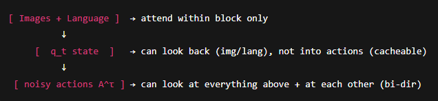
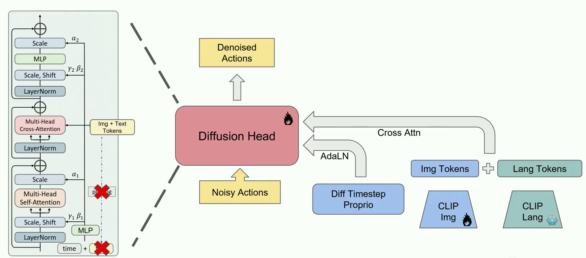
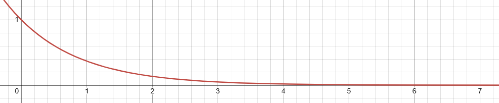
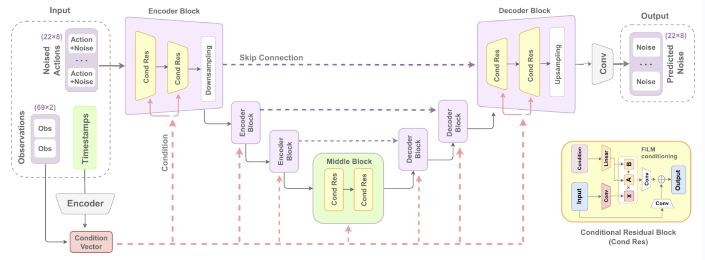
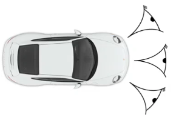

## PI
**[Real-time Chunking]([Real-Time Action Chunking with Large Models](https://www.physicalintelligence.company/research/real_time_chunking)**
- Problem: inference takes time. Supposing our control loop frequency is fixed, our options are:
	1. Accept the latency; execute one action every time inference finishes
	2. Execute actions until the next inference is ready; but the next inference might "disagree" with the prior inference that is already being executed -- this is dangerous
	3. Average overlapping actions between previous and next inference -- also dangerous + produces off-manifold actions
	4. Real-time chunking (what PI proposes)
- Basically, they just condition the inference on the result of the previous inference (it is *only* an inference time change)
	- If inference is guaranteed to take 300 ms, they "freeze" the first 300 ms of outputs of the new inference
	- The model then "partially attends" (via a "soft mask"?) to another 700 ms of actions from the prior inference, so that actions are encouraged to remain consistent even in heavy-tailed inference times
	- Finally, new actions after that are predicted from scratch
- Thus, output remains on-manifold.
**[VLAs that Train Fast, Run Fast, and Generalize Better]([VLAs that Train Fast, Run Fast, and Generalize Better](https://www.physicalintelligence.company/research/knowledge_insulation))**
- 
**[pi0.5]([A VLA with Open-World Generalization](https://www.physicalintelligence.company/blog/pi05))**
- Fine-tuning the VLM:
	- Find that fine-tuning the VLM degrades language understanding
	- Not fine-tuning the VLM degrades action performance on difficult tasks
	- Solution: "Knowledge Insulation"
		- Action loss doesn't propagate into the VLM, but they have 2 other training steps that do
			- 
			- "High-level robot commands" next-token prediction
**[pi0]([Our First Generalist Policy](https://www.pi.website/blog/pi0)**
- a "Foundation"/"Framework" for robotics foundation models
- Model:
	- 2 encoders:
		1. VLM (pretrained on internet data) encoder encodes observations (RGB images, language commands) into tokens in the same embedding space as language tokens
			1. Note: VLM weights *are* fine-tuned
		2. Action expert: Flow-matching model to denoise a noisy action tokens into clean action chunk
			- Input: outputs of VLM + proprioception tokens + noisy action tokens
				- Note: the noisy action tokens are literally pure noise
			- output: denoised actions that robot executes
			- The action expert is itself a transformer that uses cross-attention during the denoising process
				- Attention masking:
					- all actions in the action chunk can attend to each other
					- actions can also attend to VLM and proprioception tokens
							<center></center>	
				- Note: pi0 does not carry over old tokens. At each timestep, during denoising, the flow-matching model only attends to the current context and action tokens. And the context length is just 1 (the current camera images/proprioceptive state) 
- *training recipe*
	- pre-training on large diverse corpus
	- fine-tuned in high quality correct-embodiment data


## TRI
- static cameras --> very brittle to camera positioning
	- by sharing weights between vision encoders for wrist-mounted cameras and static cameras, seems to learn more invariance to camera position
<center></center>	

## Implicit Behavior Cloning
[Implicit Behavioral Cloning]([2109.00137](https://arxiv.org/pdf/2109.00137))
Notation
- $o$ = observations
- $a\in A$ = actions
- Explicit policies: $\hat{a} = f_\theta(o)$
- Implicit policies: $\hat{a} = \arg\min_{a \in A} E_\theta(o, a)$
	- $E_\theta$ is an energy function
	- Conditional energy-based modeling (EBM) problem
	- Optimize $E_\theta$ at inference time (i.e. using Gradient Descent)
Training an Implicit Model
- Dataset of samples $\{ x_i, y_i \}$, $x_i \in \mathbb{R}^m$ states, $y_i \in \mathbb{R}^n$ actions
- Goal: learn function approximator $E_\theta(x, y): \mathbb{R}^{m+n} \rightarrow \mathbb{R}$
- Loss function: $$\begin{align*} L_{infoNCE} &= \sum_{i=1}^N -\log (\tilde{p}_\theta(y_i | x_i, \{ \tilde{y}_i^j \}_{j=1}^{N_{neg}})) \qquad \text{(sum over N-batch of training pairs } (x,y)) \\ \tilde{p}_\theta(y_i | x_i, \{ \tilde{y}_i^j \}_{j=1}^{N_{neg}}) &= \frac{e^{-E_\theta(x_i, y_i)}}{e^{-E_\theta(x_i, y_i)} + \sum_{j=1}^{N_{neg}} e^{-E_\theta(x_i, \tilde{y}_i^j)}} \end{align*}$$
	- Interpretation:
		- Negative log likelihood of data distribution
		- We parameterize our probability distribution using the (normalized) energy function: $p_\theta(y | x) = \frac{e^{-E_\theta(x,y)}}{Z(x, \theta)}$
			- i.e. low energy --> high probability, high energy --> low probability
			<center></center>
		<center><sub><sup>probability vs energy (unnormalized)</sub></sup></center>
		- 2 Interpretations of Negative Sampling:
			1. As a classification objective ("**Noise Contrastive Estimation**" (NCE)):
				- Given observation $x$, there is one "true", "positive" $y$ and many "false", "negative" $\tilde{y}^i$, and a scoring function $e^{-E_\theta(x, y')}$ that gives a score for any $y'$ 
				- We frame this as a classification task -- we want to maximize the neg. log likelihood of predicting the true label $y$ given $x$ and a bunch of false labels $\tilde{y}^i$:
					- $p(\text{correct} = y | x, \{y, \tilde{y}^1, \dots, \tilde{y}^{N_{neg}}\}) = \frac{e^{-E_\theta(x, y)}}{e^{-E_\theta(x, y)} + \sum_{i=1}^{N_{neg}} e^{-E_\theta(x, \tilde{y}^i)}} \qquad \text{(using softmax function over the scores)}$
					- $-\log p(\text{correct} = y | x, \{y, \tilde{y}^1, \dots, \tilde{y}^{N_{neg}}\}) = L_{infoNCE}$
			2. As a modified Monte Carlo (MC) sampling to approximate $Z(x, \theta) = \int_{y \in \mathcal{Y}} e^{-E_\theta(x, y)}\, dy$:
				- Recall MC sampling: approximate $\int_{x \in \mathcal{X}} p(x) f(x) dx$ with $\hat{\mu}_f = \frac{1}{N} \sum_{i=1}^N f(x_i)$
					- $Z(x, \theta) = \int_{y \in \mathcal{Y}} e^{-E_\theta(x, y)}\, dy = \int_{y \in \mathcal{Y}} q(y | x) \frac{e^{-E_\theta(x,y)}}{q(y | x)}$ for some $q(\cdot | x)$
						- $\frac{e^{-E_\theta(x,y)}}{q(y | x)}$ is analogous to $f(x)$ in standard MC form
						-  $\implies$ $\hat{Z}_{MC}(x,\theta) = \frac{1}{N} \sum_{i=1}^N \frac{e^{-E_\theta(x,y_i)}}{q(y_i | x)}$ where $y_i \sim q(y_i | x)$
						- The simplest case, as is used the IBC paper, is $q(y_i | x) = \text{Unif}(\mathcal{Y}) = \frac{1}{|\mathcal{Y}|}$ 
						- Then $\hat{Z}_{MC}(x,\theta) = \frac{1}{N} \sum_{i=1}^N \frac{e^{-E_\theta(x,y_i)}}{1 / |\mathcal{Y}|} = \frac{|\mathcal{Y}|}{N} \sum_{i=1}^N e^{-E_\theta(x,y_i)}$
				- Negative Sampling:
					- $\tilde{Z}(x,\theta) = e^{-E_\theta(x, y)} + \sum_{j=1}^{N_{neg}} e^{-E_\theta(x, \tilde{y}^j)} \approx \hat{Z}(x,\theta)$ without the scalar $\frac{|\mathcal{Y}|}{N}$
						- However, $\frac{|\mathcal{Y}|}{N}$ is constant, so appears as an added constant in the neg. log likelihood, and doesn't affect $\arg\min$ of neg. log likelihood. Therefore, dropping this constant is safe.
					- Equivalent to MC sampler, except we require the positive sample $e^{-E_\theta(x, y)}$ to be included
						- The positive sample is critical because, in high dimensions, the learned energy function is supposed to be very spiky; one very low energy spot for the "right" action, very high energy everywhere else. Thus, uniform sampling in the action space (as in the MC sampler) will rarely find low-energy actions (leading to under-estimates of $Z(x,\theta)$ in most batches, and huge over-estimates of $Z(x,\theta)$ in rare occasions where a low-energy action is sampled)
							- In other words, this estimator has very high variance
						- This is a consistent (correct as $N \rightarrow \infty$) but biased estimate
				- Note: when learning distributions with a normalization constant $Z$, trying to estimate $Z$ using MC sampling is usually a bad idea
					- Even though the estimate of $Z$ is unbiased, the estimate of $\log Z$ (which appears in the neg. log likelihood) is still biased
						- Proof (Jensen's Inequality): $\mathbb{E}[\log(\hat{Z}_{MC})] < \log(\mathbb{E}[\hat{Z}_{MC}]) = Z$
					- High variance of estimate
					- Instead, it's better to try to estimate $\nabla \log Z$ directly
						- Recall (6.7810 notes): $\nabla \log Z = \mathbb{E}_{y' \sim p(\cdot | x ; \theta)}[e^{-E_\theta(x,y')}]$
						- This quantity can be estimated by sampling from $p(\cdot | x ; \theta)$ using Markov Chain Monte Carlo (MCMC)
						- Specifically, Contrastive Divergence (CD-k) is a MCMC algorithm designed for estimating $\mathbb{E}_{y' \sim p(\cdot | x ; \theta)}[e^{-E_\theta(x,y')}]$ with few samples
					- Alternatively, "NCE" methods reformulate the objective as a classification task (i.e. using negative sampling)
- Training Process:
	- Generate negative counter-examples $\{ \tilde{y}_i^j \}_{j=1}^{N_{neg}}$ for each $x_i$ in the batch
- Key Idea: 


## Action Chunking Transformer
[Learning Fine-Grained Bimanual Manipulation with Low-Cost Hardware]([2304.13705](https://arxiv.org/pdf/2304.13705))
- To tackle compounding error: action chunking
- To tackle pauses: action chunking
- To tackle smoothness: temporal ensembling (query the policy frequently, average across overlapping chunks)

```
Chunking can also help model non-Markovian behavior in human demonstrations. Specifically, a single-step policy would struggle with temporally correlated confounders, such as pauses in the middle of a demonstration, since the behavior not only depends on the state, but also the timestep. Action chunking can mitigate this issue when the confounder is within a chunk, without introducing the causal confusion issue for history-conditioned policies.
```
- 

Teleop data from leader arm is used to train model; this way, differences between leader and follower are learned implicitly as forces

**Architecture**
- ACT is distributional learning; learns a latent $z$ that encodes rough mode preferences (i.e. left vs right)
	- CVAE encoder and decoder trained together; decoder learns that the value of $z$ dictates mode preferences
	- $z$ fixed at $0$ at inference; we arbitrarily pick a mode
	- This is better than simply training a regression model that doesn't condition on $z$; this will learn to average modes while conditioning on learned $z$ tells the model that each value of $z$ corresponds to a single mode.
- CVAE Encoder architecture:
	- Take in expert action sequence and current joint position, output $z$
	- BERT-style Transformer with unmasked self-attention (i.e. prepend a `[CLS]` token, which is transformed and serves as the output)
	- The output of the BERT Transformer is fed through another MLP to get a lower-dimensional $z$
		- Need $z$ to be lower dimensional so it learns a useful but compressed signal, and doesn't just contain exact information on what the expert trajectory was
- CVAE Decoder architecture:
	- simple Transformer encoder
		- camera images, joint positions, $z$ all projected into token space using MLPs, fed as a token sequence into transformer
		- transformer uses unmasked self-attention to transform input token sequence
	- Transformer decoder conditions on entire transformed token sequence from Transformer encoder
		- Also feed $k$ (where $k$ is action chunk length) empty action tokens as input
		- Use cross attention between $k$ action tokens and Transformer encoder tokens
		- output transformed $k$ action tokens
- Outputted $k$ action tokens are compressed to an action sequence using MLP

## Diffusion Policy
[Diffusion Policy: Visuomotor Policy Learning via Action Diffusion]([2303.04137](https://arxiv.org/pdf/2303.04137))
("Original Diffusion Policy Paper")
- Formulation: $x_t^{k-1} = \alpha(x_t^k - \gamma \epsilon_\theta(x_t^k, \text{obs}_t, k) + \mathcal{N}(0, \sigma^2 I))$
	- ${}_t$ represents timestep
	- $\epsilon_\theta$ is the noise prediction network, learned params $\theta$
		- $\text{obs}_t$ is observation at timestep $t$
	- $\mathcal{N}(0, \sigma^2 I)$ is the DDPM noise added at each sampling step
	- $\alpha$ empirically set slightly smaller than 1, improving stability
	- $\gamma$ set by noise schedule 
	- Note: $k$ = denoising step

- Architecture
	<center></center>	
	- Conditional 1D U-Net
		- Conditional Residual Blocks
			- Inputs:
				- input $x \in \mathbb{R}^{N \times C \times H \times W}$
				- condition vector $c$
			- Operations (note: $N$ = batch size):
				- $h_1 = \mathrm{Conv}_1(\mathrm{GroupNorm}(x)) \in \mathbb{R}^{N \times C_{out} \times H \times W}$
				- $s = \mathrm{Conv}_{skip}(x) \in \mathbb{R}^{N \times C_{out} \times H \times W}$
				- $(\gamma, \beta) = \mathrm{MLP}(c), \quad \gamma \in \mathbb{R}^{N \times C_{out}}, \beta \in \mathbb{R}^{N \times C_{out}}$
					- $\gamma$ = weight,  $\beta$ = bias
				- Broadcast $\gamma$ to $\mathbb{R}^{N \times C_{out} \times H \times W}$, $\beta$ to $\mathbb{R}^{N \times C_{out} \times H \times W}$
				- $\tilde{h}_1 = \gamma ~\odot~\mathrm{GN}(h_1) + \beta \in \mathbb{R}^{N \times C_{out} \times H \times W}$
					- "FiLM (Feature-wise Linear Modulation) Conditioning"
				- $h_2 = \mathrm{Conv}_2(\mathrm{SiLU}(\tilde{h_1})) \in \mathbb{R}^{N \times C_{out} \times H \times W}$
				- Return $h_2 + s$
			- Note: usually these don't downsample (i.e. don't reduce $H$ and $W$, but increase channel count $C_{out}$)
		- Encoder Blocks / Decoder Blocks
			- Typically use $\mathrm{Conv}$ with larger stride to downsample
			- Typically use to upsample
		- Intuitions:
			- Skip connections in U-net ensure some high-frequency signal before the encoding makes it to the final layers
				- Rough idea: 
					- Encoder compresses information to key global layout/semantics
					- Decoder, along with skip connections, fuses global layout with fine details from skip connections
			- FiLM conditioning is simple/cheap but effective
				- Per-channel weight/bias -- channels correspond to "features", thus FiLM conditioning hits every feature with just a weight/bias (as opposed to i.e. cross attention)
		- Note: variants use cross-attention instead of FiLM conditioning, when condition is high-bandwidth, sequence data; then you include transformer blocks within each Encoder/Decoder block. See [diagrams in this ref](https://arxiv.org/pdf/2306.09762).
	- Diffusion Transformer
		- TODO

- Training
	- $\epsilon_\theta$ trained with loss: $\mathcal{L} = MSE(\epsilon^k, \epsilon_\theta(x_k + \epsilon^k, k))$
		- Mathematical Interpretation:
			- $p_\theta(x_{0:K} | \text{obs}) = p_\theta(x_K | \text{obs}) \Pi_{k=1}^K p_\theta(x_{k-1} | x_k, \text{obs})$
				- i.e. the denoising process is a Markov Chain; next state; $p(x_K | \text{obs})$ is a prior; each $x_{k-1}$ then is independent of all other $x_{i}$ given $x_k$ and $\text{obs}$.
				- $p_\theta(x_{0:K} | \text{obs})$ is the joint probability density of predicting the whole chain of latent semi-denoised "images"
			- Take the marginal to get the probability density of predicting the unnoisy image:
				- $p_\theta(x_0| \text{obs}) = \int p_\theta(x_{0:K} | \text{obs}) dx_{1:K}$
					- This is an integral over all possible denoising paths $x_{1:K}$
			- We want to minimize the KL divergence between the data distribution and DDPM distribution of sampled clean images (in other words, maximize log-likelihood; this is ML estimation):					$$\begin{align*}& \quad\; \arg\min_\theta D_{KL}(p_{\text{data}}(x_0| \text{obs}) \,\|\, p_\theta(x_0 | \text{obs})) \\ &= \arg\min_\theta \sum_{i=1}^N \big[ \log p_{\text{data}}(x_0^{(i)} | \text{obs}^{(i)}) - \log p_\theta(x_0^{(i)} | \text{obs}^{(i)}) \big] \\
						&= \arg\min_{\theta} \sum_{i=1}^N- \log p_\theta(x_0^{(i)} | \text{obs}^{(i)}) \end{align*}$$
				- Minimizing the KL Divergence directly is intractable -- 
					- Even computing the log likehood for a given $\theta$ is intractable because computing the integral in $p_\theta(x_0)$ is intractable; firstly, we are integrating over a huge neural net, not some clean math function; there's no analytical soln. But, even if you discretized and approximated the integral as a sum, you'd have to sum over all possible (discretized) denoising paths $x_{1:K}$, of which there are still tons.
				- Therefore, we minimize the (negative) *variational lower bound* (VLB) on the true log-likelihood; a computational proxy for the actual true log-likelihood
					 $$\begin{align*} 
				\log p_\theta(x_0^{(i)} | \text{obs}^{(i)}) &= \log \int p_\theta(x_{0:K} | \text{obs}) dx_{1:K} \\ 
				&= \log \int q(x_{1:K}|x_0) \frac{p_\theta(x_{0:K} | \text{obs})}{q(x_{1:K}|x_0)} dx_{1:K} \\ 
				&= \log \mathbb{E}_{q(x_{1:K}|x_0)}\big[ \frac{p_\theta(x_{0:K} | \text{obs})}{q(x_{1:K}|x_0)} \big] \\
				&\ge \mathbb{E}_{q(x_{1:K}|x_0)}\big[ \log \frac{p_\theta(x_{0:K} | \text{obs})}{q(x_{1:K}|x_0)} \big]\quad\quad\quad\text{(Jensen's Inequality)}\\
				&= \mathbb{E}_{q(x_{1:K}|x_0)}\big[ \log \frac{p_\theta(x_K | \text{obs}) \Pi_{k=1}^K p_\theta(x_{k-1} | x_k, \text{obs})}{\Pi_{k=1}^K q(x_k | x_{k-1})} \big] \\
				&= \mathbb{E}_{q(x_{1:K}|x_0)}\big[ \log p_\theta(x_K | \text{obs}) + \sum_{k=1}^K \log p_\theta(x_{k-1} | x_k,\text{obs}) - \sum_{k=1}^K \log q(x_k | x_{k-1})\big] \quad\quad\quad\text{(log rules)} \\
				&= \mathbb{E}_{q(x_{1:K}|x_0)}\big[ \log p_\theta(x_K | \text{obs}) + \sum_{k=1}^K (\log p_\theta(x_{k-1} | x_k,\text{obs}) -\log q(x_k | x_{k-1}))\big] \quad\quad\quad\text{(log rules)}
				\end{align*}$$
			
				- Note that we introduce $q$ as the forward-noising Markov Chain we used to create the training data
				- At this step, we sub in (using Bayes Rule): $\log q(x_k | x_{k-1}) = \log q(x_{k-1} | x_k, x_0) + \log q(x_k | x_0) - \log q(x_{k-1} | x_0)$
					- Bayes Rule derives the analytically ideal reverse step $q(x_{k-1} | x_k, x_0)$ from the known forward-noising process. We can then reformulate the VLB in a much more interpretable way, as matching $p_\theta(x_{k-1} | x_k, \text{obs})$ with $q(x_{k-1} | x_k, x_0)$.
	$$\begin{align*} &= \mathbb{E}_{q(x_{1:K}|x_0)}\big[ \log p_\theta(x_K | \text{obs}) + \sum_{k=1}^K (\log p_\theta(x_{k-1} | x_k,\text{obs}) -\big(\log q(x_{k-1} | x_k, x_0) + \log q(x_k | x_0) - \log q(x_{k-1} | x_0)\big))\big] \\
	&= \mathbb{E}_{q(x_{1:K}|x_0)}\big[ \log p_\theta(x_K | \text{obs}) + \sum_{k=1}^K (\log p_\theta(x_{k-1} | x_k, \text{obs}) - \log q(x_{k-1} | x_k, x_0) - \log q(x_k | x_0) + \log q(x_{k-1} | x_0))\big] \\ &\text{\quad (Distribute the negative sign)}\\\\ 
	&= \mathbb{E}_{q(x_{1:K}|x_0)}\bigg[ \log p_\theta(x_K | \text{obs}) + \sum_{k=1}^K \bigg(\log \frac{p_\theta(x_{k-1}|x_k, \text{obs})}{q(x_{k-1}|x_k,x_0)}\bigg) - \sum_{k=1}^K \bigg(\log q(x_k|x_0) - \log q(x_{k-1}|x_0)\bigg) \bigg] \\ 
	&\text{\quad (Group terms into log ratios and separate the sums)}\\\\ 
	&= \mathbb{E}_{q(x_{1:K}|x_0)}\bigg[ \log p_\theta(x_K | \text{obs}) + \log \frac{p_\theta(x_0|x_1, \text{obs})}{q(x_0|x_1,x_0)} + \sum_{k=2}^K \log \frac{p_\theta(x_{k-1}|x_k, \text{obs})}{q(x_{k-1}|x_k,x_0)} - \big(\log q(x_K|x_0) - \log q(x_0|x_0)\big) \bigg] \\ 
	&\text{\quad (Split the first sum to separate the k=1 reconstruction term; the second sum is a telescoping series which simplifies)}\\\\ 
	&= \mathbb{E}_{q(x_{1:K}|x_0)}\bigg[ \log p_\theta(x_K | \text{obs}) + \log p_\theta(x_0|x_1, \text{obs}) - \log q(x_0|x_1,x_0) + \sum_{k=2}^K \log \frac{p_\theta(x_{k-1}|x_k, \text{obs})}{q(x_{k-1}|x_k,x_0)} - \log q(x_K|x_0) + \log q(x_0|x_0) \bigg] \\ 
	&\text{\quad (Expand first log; distribute minus sign on the telescoped terms)}\\\\ 
	&= \mathbb{E}_{q(x_{1:K}|x_0)}\bigg[ \log p_\theta(x_0|x_1, \text{obs}) + \sum_{k=2}^K \log \frac{p_\theta(x_{k-1}|x_k, \text{obs})}{q(x_{k-1}|x_k,x_0)} + \log p_\theta(x_K | \text{obs}) - \log q(x_K|x_0) \bigg] \\ 
	&\text{\quad (Regroup/reorder the remaining terms, canceling the } \log q(x_0|x_0) \text{ terms)}\\\\ 
&= \mathbb{E}_{q(x_1|x_0)}[\log p_\theta(x_0|x_1, \text{obs})] + \sum_{k=2}^K \mathbb{E}_{q(x_0,x_{k-1},x_k|x_0)}\bigg[\log \frac{p_\theta(x_{k-1}|x_k, \text{obs})}{q(x_{k-1}|x_k,x_0)}\bigg] + \mathbb{E}_{q(x_K|x_0)}\bigg[\log \frac{p_\theta(x_K | \text{obs})}{q(x_K|x_0)}\bigg] \\ 
&\text{\quad (Distribute the expectation. Note that each term only depends on a subset of } x_{1:K} \text{, so the expectation marginalizes out the irrelevant variables.)}\\\\ 
&= \mathbb{E}_{q(x_1|x_0)}[\log p_\theta(x_0|x_1, \text{obs})] - \sum_{k=2}^K \mathbb{E}_{q(x_k, x_0)}\bigg[ \mathbb{E}_{q(x_{k-1}|x_k, x_0)}\bigg[\log \frac{q(x_{k-1}|x_k,x_0)}{p_\theta(x_{k-1}|x_k, \text{obs})}\bigg] \bigg] - \mathbb{E}_{q(x_K|x_0)}\bigg[\log \frac{q(x_K|x_0)}{p_\theta(x_K | \text{obs})}\bigg] \\ 
&\text{\quad (Apply Law of Total Expectation to the expectation in the sum. The full expectation is broken into an inner expectation over } x_{k-1} \text{ and an outer one over } x_k, x_0)\\\\ 
&= \mathbb{E}_{q(x_1|x_0)}[\log p_\theta(x_0|x_1, \text{obs})] - \sum_{k=2}^K \mathbb{E}_{q(x_k,x_0)}[D_{KL}(q(x_{k-1}|x_k, x_0) \ || \ p_\theta(x_{k-1}|x_k, \text{obs}))] - D_{KL}(q(x_K|x_0) \ || \ p_\theta(x_K | \text{obs})) \\ 
&\text{\quad (Identify the inner expectations as the definitions of KL Divergence)} \\\\
&= - \sum_{k=1}^K \mathbb{E}_{q(x_k,x_0)}[D_{KL}(q(x_{k-1}|x_k, x_0) \ || \ p_\theta(x_{k-1}|x_k, \text{obs}))] - D_{KL}(q(x_K|x_0) \ || \ p_\theta(x_K | \text{obs})) \\
&\text{\quad ("Fold" the first term into the } k=1 \text{ case of the sum)}
	\end{align*}$$
	- The last equality is non-obvious, but if we expand the $k=1$ case of the sum, we can see this:
		$$\begin{align*} \mathbb{E}_{q(x_k,x_0)}[D_{KL}(q(x_0|x_1, x_0) \ || \ p_\theta(x_0|x_1, \text{obs}))] &= \mathbb{E}_{q(x_k,x_0)}[D_{KL}(\delta_{x_0} \ || \ p_\theta(x_0|x_1, \text{obs}))] \\ &= \mathbb{E}_{q(x_1|x_0)}[\log p_\theta(x_0|x_1, \text{obs})]\end{align*}$$
	- The last term of VRB, $D_{KL}(q(x_K|x_0) \ || \ p_\theta(x_K | \text{obs}))$ is also trivial and so it's dropped
		- Both are just a standard Gaussian prior; there are no parameters to learn here.
	- This yields the final objective (there are a few more steps to simplify this to the MSE loss described in the paper): $$\arg\min_\theta- \sum_{k=1}^K \mathbb{E}_{q(x_k,x_0)}[D_{KL}(q(x_{k-1}|x_k, x_0) \ || \ p_\theta(x_{k-1}|x_k, \text{obs}))]$$
	- The next key realization is that, during training: "we randomly select denoising iteration $k$ and then sample a random noise $\epsilon_k$ with appropriate variance for iteration $k$"
		- Basically, we never compute the loss for the whole denoising sequence $\sum_{1:K}$; we sample a single denoising step $k$ and compute the loss just for that.
		- (With enough samples, optimizing using the sampled per-denoising step loss should be equivalent to optimizing using the sum of losses from all denoising steps)
		- Thus, we basically optimize, for a single $k$ per step of training: $$\arg\min_\theta- \mathbb{E}_{q(x_k,x_0)}[D_{KL}(q(x_{k-1}|x_k, x_0) \ || \ p_\theta(x_{k-1}|x_k, \text{obs}))]$$
	- The last key realization is that both distributions: $q(x_{k-1} | x_k, x_0)$ and $p_\theta(x_{k-1} | x_k, \text{obs})$ are Gaussian with mean equal to $x_{k-1}$ (or our current prediction of $x_{k-1}$) and variance fixed by the noise scheduler.
		- $q(x_{k-1} | x_k, x_0)$ is by design of the diffusion noising process as adding Gaussian noise
		- $p_\theta(x_{k-1} | x_k \text{obs})$ also is by design of the denoising process. 
	- The KL-Divergence between 2 Gaussians (w/ fixed, diagonal covariance) has closed-form:  $$D_{KL}\!\left(\mathcal{N}(\tilde{\mu}_k, \tilde{\beta}_k I) \,\|\, \mathcal{N}(\mu_\theta, \sigma_k^2 I)\right) = \text{const} + \frac{1}{2\sigma_k^2} \left\| \tilde{\mu}_k(x_k, x_0) - \mu_\theta(x_k, k) \right\|^2$$ 
		- Typically, we simply drop the $\text{const} + \frac{1}{2\sigma_k^2}$ terms and minimize $\left\| \tilde{\mu}_k(x_k, x_0) - \mu_\theta(x_k, k) \right\|^2$. This works in practice, though we are no longer minimizing exactly the VLB.
			- The $\frac{1}{2\sigma_k^2}$ multiplier is effectively a weighting depending on the current denoising step; Ho et al. (original DDPM paper) find empirically that dropping this weighting is actually better.
	- However, the model doesn't predict the "image" (i.e. $\mu_\theta$) directly -- it predicts the noise vector between $x_k$ and $x_{k-1}$. Thus, we must take one final step to convert the MSE error of $\mu$ to an MSE error of the noise vectors $\epsilon$ and $\epsilon_\theta$.
		- Recall the forward noising process adopted by Diffusion Policy: $q(x_k | x_{k-1}) := \mathcal{N}(x_{k}; \sqrt{\alpha_k} x_{k-1}, (1-\beta_k) I) \quad \implies \quad q(x_k | x_0) = \mathcal{N}(x_k; \sqrt{\bar{\alpha}_k} x_0, (1 - \bar{\alpha_k})I)$ where $\bar{\alpha}_t = \prod_{s=1}^t \alpha_s$
			- Thus, a sample $x_k$ can be generated as (where $\epsilon \sim \mathcal{N}(0,1)$): $x_k = \sqrt{\bar{\alpha}_k} x_0 + \sqrt{1 - \bar{\alpha}_k}\epsilon$
			- This implies: 		$$\mu_\theta(x_k, k) = \frac{1}{\sqrt{\alpha_k}} \left(x_k - \frac{1 - \alpha_k}{\sqrt{1 - \bar{\alpha}_k}} \, \epsilon_\theta(x_k, \text{obs}, k)\right)$$
			- Then, minimizing $\left\| \tilde{\mu}_k(x_k, x_0) - \mu_\theta(x_k, k) \right\|^2$ is equivalent to:			$$\begin{align*}
			& \;\;\;\;\; \arg\min_\theta \left\| \frac{1}{\sqrt{\alpha_k}}\left(x_k - \frac{1 - \alpha_k}{\sqrt{1 - \bar{\alpha}_k}}\epsilon\right) - \frac{1}{\sqrt{\alpha_k}}\left(x_k - \frac{1 - \alpha_k}{\sqrt{1 - \bar{\alpha}_k}}\epsilon_\theta(x_k, \text{obs}, k)\right) \right\|^2 \\
			&= \arg\min_\theta \frac{1}{\alpha_k} \left\| \left( x_k - \frac{1 - \alpha_k}{\sqrt{1 - \bar{\alpha}_k}}\epsilon \right) - \left( x_k - \frac{1 - \alpha_k}{\sqrt{1 - \bar{\alpha}_k}}\epsilon_\theta(x_k, \text{obs}, k) \right) \right\|^2 \\
			&= \arg\min_\theta \frac{1}{\alpha_k} \left\| -\frac{1 - \alpha_k}{\sqrt{1 - \bar{\alpha}_k}}\epsilon + \frac{1 - \alpha_k}{\sqrt{1 - \bar{\alpha}_k}}\epsilon_\theta(x_k, \text{obs}, k) \right\|^2 \\
			&= \arg\min_\theta \frac{1}{\alpha_k} \left( \frac{1 - \alpha_k}{\sqrt{1 - \bar{\alpha}_k}} \right)^2 \left\| \epsilon_\theta(x_k, \text{obs}, k) - \epsilon \right\|^2 \\
			&\implies  \arg\min_\theta \left\| \epsilon_\theta(x_k, \text{obs}, k) - \epsilon \right\|^2
			\end{align*}$$
				- In the last step, we simply drop the constant coefficient, which the DDPM authors finds to empirically work better (and simplify the formulation) 
			- This is exactly the MSE loss proposed in the paper.
	- Notes:
		- This is a skewed way of looking at it, but: diffusion-policy training is kind like the EM algorithm with a trivial E-step. We already know the ground-truth $q(\cdot | x_0)$ used to generate the training data; so there is no need to optimize $q$ as we do in EM. Rather, we just perform the M-step of optimizing $\theta$.
		- The VLB becomes tighter as the model better learns to approximate $q(\cdot | x_0)$ using $p_\theta(\cdot | x_0, \text{obs})$; this is not obvious from the math shown above; but see my 6.7810 notes on EM; $D_{KL}(q(\cdot | x_0) \| p_\theta(\cdot | x_i, \text{obs}))$ is exactly the gap between VBL and the true log likelihood.
			- This is not true of EM in general; only true here because the ground-truth $q(\cdot | x_0)$ is known. Also, in practice, in EM, we often restrict $q(\cdot | x_0)$ to something simple like a Gaussian, even though the ground-truth $q(\cdot | x_0)$ may not be a Gaussian. Thus the VLB gap is not closable.
		- The underlying graphical model is a directed Markov Chain:
				$x_K \sim p_\theta(x_K \mid \text{obs}) \; (\text{often } \mathcal{N}(0, I)), \quad x_{t-1} \sim p_\theta(x_{t-1} \mid x_t, \text{obs}), \quad t = K, \ldots, 1$ 
		  and the forward noising process can also be seen as a Markov Chain (though nothing to learn in this case):
				$x_t \sim q(x_t \mid x_{t-1}) \quad \text{with known Gaussians set by noise schedule}, \quad x_0 \sim \text{data}$.
		- The parameters $\theta$ live in the neural network, but represent (using a neural net) the probability distributions $p(x_{t-1} | x_t, \text{obs})$
 
- DDIM vs DDPM Sampling
	- Key Idea: You may want to vary the number of denoising steps during inference to speed up inference
	- DDPM
		- requires same denoising steps as in training formulation?
	- DDIM

- Model Architecture
	- 2 Proposed Architectures:
		- CNN
			- Qualitative Characteristics:
				- easy-to-use; works out of the box for most tasks
				- performs poorly when action sequences changes quickly in time
					- "inductive bias of temporal convolutions to prefer low-frequency signals"
		- Transformer
			- Qualitative Characteristics:
				- Higher performance, more hyperparmeter tuning (i.e. LR, batch size, transformer layers, dimensions, layer norm, noise schedule/number of denoising steps, step size, etc.)

- Position vs Velocity Control
	- Position Control is strictly better -- 
		- Multi-modality more pronounced (i.e. each mode around the T has all different positions but velocity in the same direction for much of the trajectory)
		- Velocity control more subject to compounding error (i.e. in an action chunk of 8, the positions are absolute so some deviation at one waypoint can be corrected in the next waypoint. But velocities are relative by nature, so deviation in one velocity waypoint will not be corrected within the action chunk.)

- Vision-Encoder Training:
	- Fine-tuning is necessary (prefers some different vision representation)
	- However, training from scratch is not good (not enough data, probably)


			
- The special thing about this noise schedule is that, no matter the denoising step or noise level, total variance stays the same (?):
			$$ \operatorname{Var}(x_k) = (\sqrt{\bar{\alpha}_k})^2 \operatorname{Var}(x_0) + (\sqrt{1 - \bar{\alpha}_k})^2 \operatorname{Var}(\epsilon) = \bar{\alpha}_k \cdot 1 + (1 - \bar{\alpha}_k) \cdot 1 = 1 $$

## Video Models
[mimic-video]([mimic-video: Video-Action Models for Generalizable Robot Control Beyond VLAs](https://mimic-video.github.io/))
- Key idea: replace standard VLM/vision encoders with a full diffusion-transformer video-model
	- Action-model (flow-matching or diffusion) then conditions on some latents from the video model (in addition to robot proprioception data) to denoise actions
- Key idea: to produce latents for the action model to condition on, use outputs of k'th layer of video model after $\mathcal T_v$ denoising steps
	- $\mathcal T_v$ denoising steps so only partial denoising of the video model is needed, for 2 reasons:
		1. near $\mathcal T_v \rightarrow 0$, input is already close to the target, and the model is incentivized toward a near identity mapping, so latents are less meaningful
		2. inference speed
	- Rather than using the full outputs of the video model, output model's internal latents at k'th layer:
		- final output of video model is just a vector in video-space (i.e. from the denoising vector field); not useful for action model
		- but, internal latents of video model do contain useful information about action plan
			- they pick k to be somewhat early in the model; they hypothesize that later layers of the model are more involved in pixel-level refinement while early layers capture actual high-level robot plan information 
- Details:
	- Video model is first fine-tuned using LoRA on robot-specific data
	- Video model is then frozen during action model training
- Key benefits:
	1. Data efficiency
	2. Training efficiency

## VLAs
[OpenVLA: LeRobot Research Presentation #5 by Moo Jin Kim]([https://www.youtube.com/watch?v=-0s0v3q7mBk)
- Timeline of VLA's:
	- Pre-2023 era:
		- RT-2, OpenVLA: co-fine-tuning a web-scale VLM to output action tokens (i.e. text token representing numbers or a bin number, which is converted to a desired pose)
			- Proof of concept for zero-shot semantic generalization, language conditioning, very simple manipulation tasks
	- 2023-2024:
		- Dexterity jump: Diffusion policies + ACT -- new way to represent visuomotor control -- as diffusion denoising process. Unlocked dexterity
	- 2024-2025:
		- Integration into VLAs: Attach web-scale VLM head to an action expert (either a diffusion policy or an ACT)
		- Unlocked high-dexterity generalist policies
- OpenVLA:
	- Llama VLM taken out of the box, but fine-tuned on OXE dataset to output action tokens
- Findings:
	- fine-tuning vision encoder using robot data is critical
		- likely also good to re-introduce internet data during VLM fine-tuning so it doesn't "forget" the internet data it was trained on
	- better VLM definitely makes performance better

## BID
[Bidirectional Decoding: Improving Action Chunking via Guided Test-Time Sampling](https://arxiv.org/abs/2408.17355))
- Summary: At each control step, sample a batch of candidate future action-chunks and pick one that is simultaneously (i) coherent with the previously chosen chunk and (ii) likely to lead to a good future plan
	- candidate evaluation criteria:
		- Penalize the (decayed) L2 distance between each candidate chunk and the previously selected chunk over their overlapping timesteps
		- Compare each candidate to two reference sets: positives from a strong policy checkpoint and negatives from a weaker checkpoint. Pick candidates that are close to strong and far from weak over the predicted horizon
- Action horizon analyses (assume the model is given context $c$ of previous states & actions):
	- Dataset $D = \{\tau_i\}_{i=1}^N$ of demonstrations $\tau_i = \{(s_1, a_1), (s_2, a_2), ... (s_T, a_T\}$
	- Model is joint distribution of $l$ (prediction horizon) new actions conditioned on $c$ (context length) past states: $\pi(a_{t:t+l} | s_{t-c:t})$
		- Model minimizes loss: $\pi = \arg\min_{\pi} \sum_{\tau \in \mathcal{D}} \sum_{s_{t-c:t},\, a_{t:t+l}} \mathcal{L}\!\left(\pi(a_{t:t+l} \mid s_{t-c:t}), \pi^{*}(a_{t:t+l} \mid s_{t-c:t})\right)$
	- When predicting $a_t$ at $t = \text{last timestep in action horizon}$:
		- With action horizon $h$:
			- $\pi_{(c,h)}(a_t | s_{t-h-c : t-h}, a_{t-h : t-1})$
		- With longer action horizon $h+d$:
			- $\pi_{(c,h+d)}(a_t | s_{t-h-d-c : t-h-d}, a_{t-h-d : t-1})$
		- Effectively: longer action horizon has access to less recent state information (reduced reactivity) (though, either way, it has access to the $c$-length state context) but a longer action history (improved temporal consistency) (since it has access to actions within the execution chunk).
			- longer action horizon performs better when there's little noise/unexpected state changes and state can be safely inferred from actions alone (thus, the longer action horizon's ability to condition on a longer action chunk helps).
			- shorter action horizon performs better when there is environment stochasticity, or if there is distribution shift (i.e. learned dynamics differ from real dynamics, so the inferred states from the action horizon's longer action context are wrong). 
	- Claim that there is no universally optimal action horizon -- depends on noise in the environment

## Principles of Behavior Cloning
- Classic supervised learning objective: (MLE on predicting the data distribution)
$$ \max_\theta \mathbb E_{\mathbf o_t \sim p_{data}(\mathbf o_t)}[\log \pi_\theta(\mathbf a_t | \mathbf o_t)]$$
- What we actually care about in behavior cloning (minimizing the number of "mistakes" the policy makes in the distribution of states it induces during execution ($c(\mathbf s_t, \mathbf a_t)$ returns penalty of 1 per mistake):
$$\min_\theta \mathbb E_{\mathbf s_t \sim p_{\pi_\theta(\mathbf s_t)}} [c(\mathbf s_t \mathbf a_t)], \qquad c(\mathbf s_t, \mathbf a_t) = \cases{0 \quad\text{ if } a_t = \pi^*(\mathbf s_t) \\ 1 \quad\text{ otherwise}}$$
- Fundamental difference between supervised learning and behavior cloning: distribution shift
	- Supervised learning relies on i.i.d. data samples assumption; this falls apart in behavior cloning where previous robot actions heavily influence future states/observations
	- Worst case: "tight-rope walker"
		- Consider an episode length $T$; at every time step, only 1 correct action $\pi^*(\mathbf s_t)$. Taking an incorrect action leads to catastrophic task failure.
		- Assume $p(\pi_\theta(\mathbf s_t) \ne \pi^*(\mathbf s_t)) \le \epsilon \quad \forall t$
			$$ \mathbb E \bigg[\sum_{t=1}^T c(\mathbf s_t, \mathbf a_t) \bigg] \le \epsilon T + (1-\epsilon T)\big( \epsilon(T-1) + (1-\epsilon)(\epsilon(T-2) + \dots)\big) = O(\epsilon T^2)$$
		- The # mistakes scales quadratically with $T$. 
			- Intuitively, you should expect # mistakes to scale linearly, so behavior cloning does really bad.
	- We can show that $O(\epsilon T^2)$ is an upper bound on $\mathbb E \bigg[\sum_{t=1}^T c(\mathbf s_t, \mathbf a_t) \bigg]$ for any problem:
		- TODO
- Why Behavior Cloning works in practice:
	- Most problems are unlike the "tight-rope walker" -- mistakes are recoverable
	- Behavior cloning works well when you make it easy to learn recoveries
		- Example: broader training distributions
		- Example: 	<center></center>
			- 
		- Example: DAgger